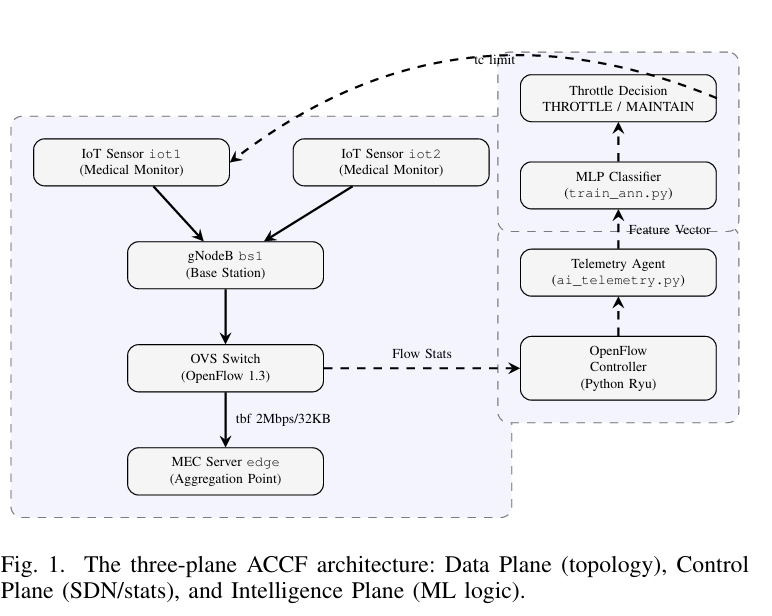

# AI-Driven Congestion Prediction for 6G IoT Networks

## Overview

This project presents an AI-driven anticipatory congestion control framework for simulated 6G IoT backhaul networks using Machine Learning and Software Defined Networking (SDN).

The framework predicts network congestion using a Multi-Layer Perceptron (MLP) model trained on telemetry parameters such as:

- Queue Size
- Network Latency
- Available Bandwidth
## ACCF Architecture

The proposed Anticipatory Congestion Control Framework (ACCF) integrates SDN telemetry and Machine Learning to predict congestion before queue overflow occurs.



## Features

- Congestion prediction using MLP
- Real-time telemetry analysis
- SDN-based congestion management
- Dataset generation and training pipeline
- Performance visualization

## Technologies

- Python
- Scikit-Learn
- Mininet-WiFi
- Open vSwitch
- SDN
- MLP Neural Networks

## Results

- 97% congestion prediction accuracy
- Average latency reduced from 41.61 ms to 18.61 ms
- Approximately 55% latency improvement

## Project Structure

```text
AI-Driven-Congestion-Prediction-6G-IoT
├── README.md
├── dataset
├── research-paper
├── results
└── src
```

## Author

Vinayak Khandelwal
NSUT Delhi
## Development Progress

### May 20
Initial project implementation covering the congestion dataset,
AI telemetry, ANN training pipeline, and 6G backhaul simulation.

### May 23
Documented the overall workflow connecting telemetry collection,
AI-based congestion prediction, and the backhaul control process.

### May 26
Expanded documentation for the AI prediction component and
anticipatory congestion-control mechanism.

### May 29
Added documentation describing the evaluation process and
congestion-performance results.

### May 31
Finalized the initial project documentation and consolidated
the implementation, workflow, and evaluation overview.
